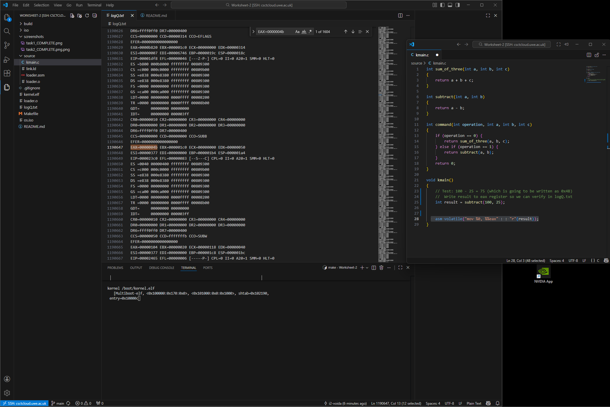
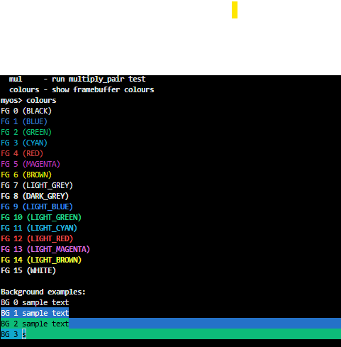
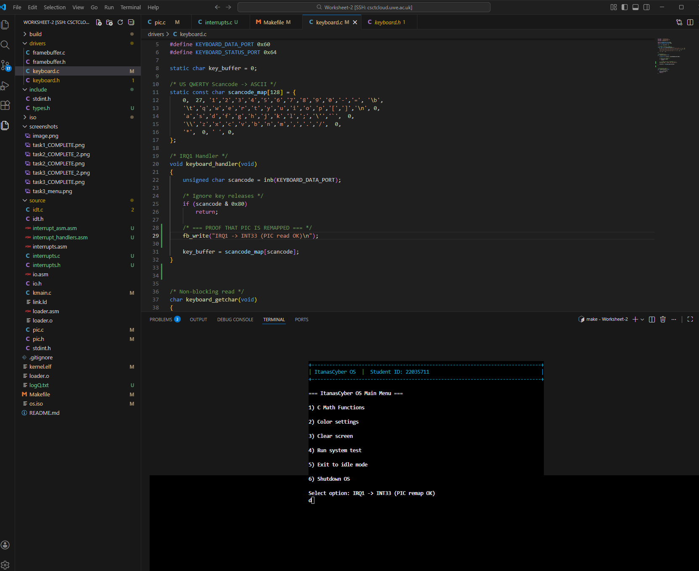

Worksheet 2 – Operating Systems

Inputs & Interrupts (Parts 1 & 2)
Student ID: 22035711

Build & Run

Requirements: make, qemu-system-i386, genisoimage (or mkisofs)

# build kernel and ISO
make

# run in curses (text) mode
qemu-system-i386 -curses -monitor telnet::45454,server,nowait \
    -serial mon:stdio -boot d -cdrom os.iso -m 32

# run in nographic mode
qemu-system-i386 -nographic -boot d -cdrom os.iso -m 32

Repository Structure

source/loader.asm, source/link.ld – Multiboot entry and linker script

source/kmain.c – kernel entry point and terminal

drivers/framebuffer.c – VGA text-mode framebuffer driver

drivers/keyboard.c, drivers/input.c – keyboard driver and circular input buffer

source/interrupts.c, source/pic.c, source/interrupt_asm.asm – IDT, PIC, and ISR stubs

source/io.asm – port I/O helpers (inb, outb, outw)  
iso/boot/grub/ – GRUB configuration and boot files  
screenshots/ – evidence for all tasks

Summary of Features

- Multiboot-compliant kernel loaded by GRUB at 1 MiB
- Custom linker script and assembly loader
- Assembly → C transition with manual stack setup
- VGA framebuffer driver with cursor control and colours
- Interrupt-driven keyboard input via PIC and IDT
- Circular input buffer with getc() and readline()
- Minimal terminal supporting help, clear, echo, and math tests
- Verified port I/O primitives (`inb`, `outb`) used by the PIC and keyboard drivers

Part 1 – Starting a Tiny OS
Task 1: Bootloader & Linker Script

The kernel is loaded using GRUB and follows the Multiboot specification.
The Multiboot header in loader.asm defines the required MAGIC, FLAGS, and CHECKSUM.
A custom linker script places the kernel at address 0x00100000, which avoids conflicts with BIOS and GRUB memory.

As required by the worksheet, the loader writes 0xCAFEBABE into the EAX register before transferring control to C.

Evidence:

Task 2: Calling C from Assembly

After setting up a kernel stack in assembly, the loader calls the C entry point kmain.
This demonstrates how C code can be executed without a runtime or standard library.

The required function:

int sum_of_three(int a, int b, int c)

is implemented and exposed through the terminal, alongside two additional C functions (subtraction and multiplication), satisfying the worksheet requirements.

Evidence:

Task 3: Framebuffer Driver

Text output is implemented using the VGA framebuffer at memory address 0xB8000.
The framebuffer driver supports:

Writing characters and strings

Integer and hexadecimal output

Cursor positioning using VGA I/O ports (0x3D4, 0x3D5)

Foreground and background colours

Screen clearing and simple 2D helpers

A colour demonstration command shows multiple foreground/background combinations in a single screen.

Evidence:

Task 4: Documentation

This README documents all design decisions and includes screenshots demonstrating successful execution of each task, as required.

Part 2 – Inputs & Interrupts
Interrupt System Overview

To support keyboard input, hardware interrupts were implemented following Chapter 6 of the OS handbook.
This required configuring the Programmable Interrupt Controller (PIC), installing an Interrupt Descriptor Table (IDT), and writing assembly interrupt stubs.

The PIC is remapped so hardware IRQs do not conflict with CPU exceptions, placing the keyboard interrupt at vector 33 (IRQ1).

Keyboard Driver & Input Buffer

Keyboard scan codes are read from I/O port 0x60 using the inb instruction.
Only key-press events are processed, and scan codes are translated into ASCII characters.

All input is stored in a 256-byte circular buffer, populated inside the keyboard interrupt handler.
Two functions expose this buffer to the rest of the kernel:

getc() – returns a single buffered character

readline() – blocks until a newline is received

This ensures input handling is fully interrupt-driven and decoupled from higher-level code.

Evidence:

Terminal Interface

A minimal terminal runs on top of the input system and framebuffer driver.
It displays a prompt (myos>) and supports the following commands:

help – list available commands

clear – clear the screen

echo <text> – print text

sum – run the C math function test
