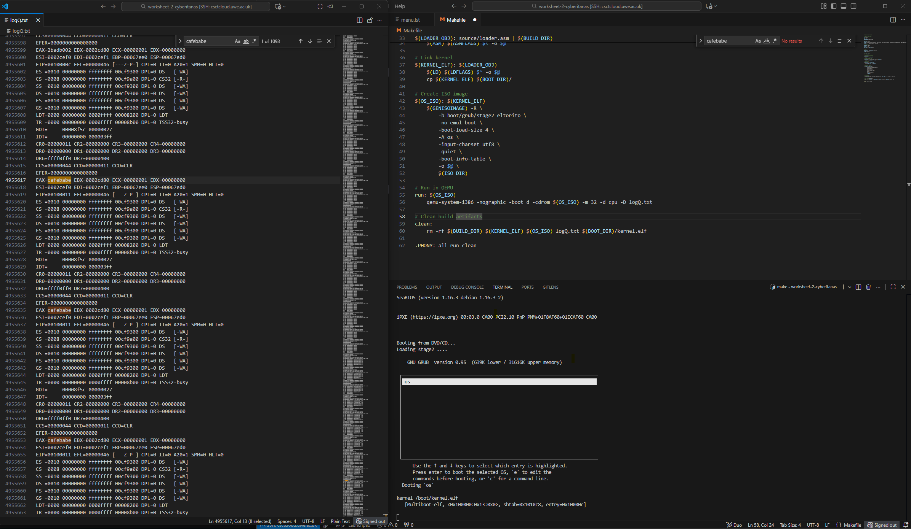
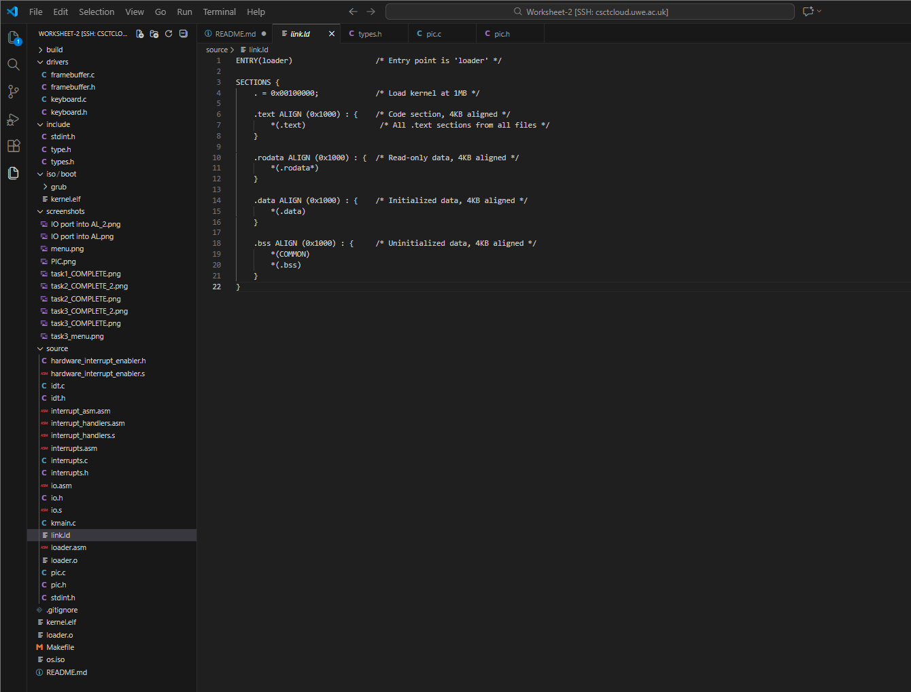
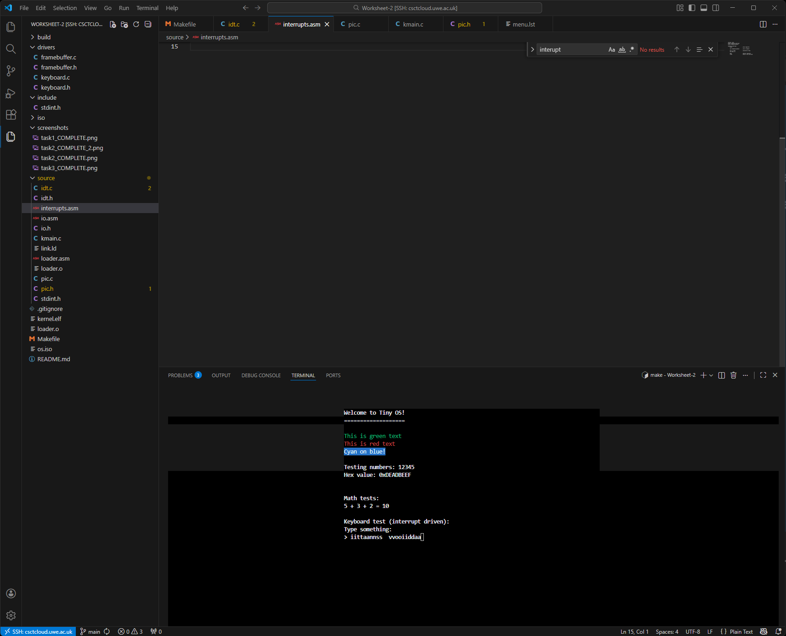

# Worksheet 2 part 1– Inputs & Interrupts
---

## 1. Task 1 — Bootloader, Linker Script, and Minimal Kernel

### Bootloader (loader.asm)

The bootloader is implemented according to the Multiboot specification.
It declares:

* `MAGIC_NUMBER = 0x1BADB002`
* `FLAGS = 0x0`
* `CHECKSUM = -(MAGIC_NUMBER + FLAGS)`

These constants allow GRUB to recognise the kernel as a valid Multiboot OS image.

The `.text` section contains the entry point `loader:` which initially loads:

```asm
mov eax, 0xCAFEBABE
```

This satisfies Task 1’s requirement to boot into an OS that sets `EAX = 0xCAFEBABE` and halts in an infinite loop. GRUB loads this at the physical address `0x00100000` as specified by the linker script.

### Linker Script (link.ld)

The linker script:


* places the kernel at the **1 MB boundary**, as GRUB requires
* aligns `.text`, `.rodata`, `.data`, and `.bss` sections to 4 KB boundaries
* defines the entry point `ENTRY(loader)`

This ensures the generated ELF file is compatible with Multiboot.

### ISO Construction

The Makefile:

* compiles the kernel
* copies `kernel.elf` into `iso/boot/`
* copies GRUB’s boot files into `iso/boot/grub/`
* embeds a valid `menu.lst` describing how GRUB boots the OS
* uses `genisoimage` to create `os.iso`

Running on QEMU using:

```
qemu-system-i386 -nographic -boot d -cdrom os.iso -m 32 -d cpu -D logQ.txt (this later changes in worksheet part 2)
```

allows validation that `EAX = 0xCAFEBABE`, satisfying Task 1 completely.

---

## 2. Task 2 — Transition to C and Implementation of C Functions

### Calling C from Assembly

In `loader.asm`, instead of halting after writing to EAX, control is passed to C via:

```asm
extern kmain
call kmain
```

The stack and multiboot parameters are forwarded properly.

### sum_of_three() and Additional C Functions


The required function:

```c
int sum_of_three(int a, int b, int c)
```

is implemented and used in the "System Test" menu.
Two additional C functions were added:

1. **Subtraction**

Testing for calling C function to subtract 100 - 25 and write to eax in hex.

2. **Multiplication**

These are exposed in the C Math Menu of the kernel.

A full interactive menu system is written using the framebuffer API, allowing users to exercise the functions inside the running OS.

---

## 3. Task 3 — Framebuffer Driver, Cursor, Colors, and Enhanced UI

### Framebuffer Implementation

The framebuffer driver in `drivers/framebuffer.c` provides:

* direct memory-mapped I/O to address `0xB8000`
* `fb_putc()`, `fb_write()`, `fb_write_int()`, `fb_write_hex()`
* scrolling and cursor manipulation
* support for foreground/background colors

The cursor is controlled using I/O ports (`0x3D4`, `0x3D5`), implementing:


```c
void fb_set_cursor_pos(int x, int y);
void fb_enable_cursor(int start, int end);
```

### 2D API Implementation

The driver exposes a clear 2D drawing abstraction:

* `fb_draw_box()`
* `fb_write_at(x, y, text)`
* `fb_clear()`
* runtime color selection via menu

This satisfies the requirement for a full 2D framebuffer API.

### System Test Screen

The system test demonstrates all framebuffer features:

* drawing a header box
* writing text in different colours
* printing integers and hex values
* verifying math functions

### QEMU Curses Mode

The OS runs in text mode using:

```
qemu-system-i386 -curses -monitor telnet::45454,server,nowait \
    -serial mon:stdio -boot d -cdrom os.iso -m 32
```

A second terminal provides telnet access to exit QEMU safely.

---

## 4. Task 4 — Interrupts, PIC, IDT, and Keyboard Input (Worksheet 2 Part 2)

### I/O Ports (inb / outb)

Per worksheet instructions, I implemented:

```asm
global inb
global outb
global outw
```

in `io.asm`, allowing the OS to interact with hardware.
These match the required prototypes:

```c
unsigned char inb(unsigned short port);
void outb(unsigned short port, unsigned char data);
void outw(unsigned short port, unsigned short value);
```

### PIC Remapping & Interrupt Enabling

The PIC driver (`pic.c`) implements:

* `pic_remap(0x20, 0x28)`
* masking/unmasking IRQs
* enabling IRQ1 for the keyboard
* acknowledging interrupts using EOI commands

This satisfies all PIC-related requirements.

### IDT and Interrupt Descriptors

My `interrupts.h` and `interrupts.c` implement:

* the IDT entry structure
* the IDT pointer
* CPU state & stack state structures
* `interrupts_install_idt()` to install handlers
* connection between assembly stubs and C dispatcher

### Assembly Interrupt Handlers

Two files were implemented:

#### interrupt_handlers.asm

Defines:

```
load_idt
```

to load the IDT register via `lidt`.

#### interrupt_asm.asm

Defines generic interrupt stubs and specific handlers:

* `interrupt_handler_33` (IRQ1 keyboard)
* `interrupt_handler_14` (page fault)

These push the interrupt number + error code and jump to the shared handler.

### Keyboard Driver

The keyboard driver:

* reads scancodes from I/O port `0x60`
* converts scancodes via lookup table to ASCII
* stores the last keypress into a buffer
* exposes `keyboard_getchar()` for non-blocking reads

### Integration in Kernel (kmain)

The kernel:

1. installs the IDT
2. installs interrupt handlers
3. initialises PIC / unmasks IRQ1
4. enables interrupts (`sti`)

Idle mode echoes keystrokes, demonstrating that the interrupt-driven input system works.


